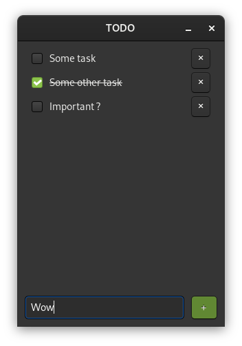

# Simple TODO list

This is a simple TODO list app built with:
- C++ 17+
- SQLite3 (custom wrapper)
- GTKmm3 (C++ bindings for GTK3)

To install the app, simply clone the repo and run `./install.sh` :
- The program uses the repo's files (easy to update & uninstall)
- A desktop entry is created in `~/.local/share/applications/` (GNOME only)

Tasks and their state are stored in a SQLite database to keep track of them.
