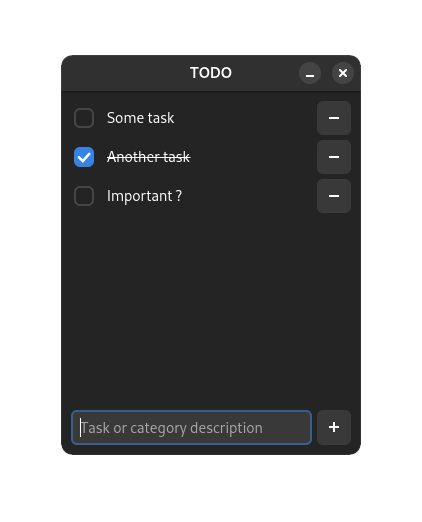

# Simple TODO list

Dependencies:
- [C++17](https://en.cppreference.com/w/cpp/17) or above
- [nlohmann_json](https://github.com/nlohmann/json)
- [gtkmm4](https://gtkmm.gnome.org/fr/download.html)

Building:
```bash
meson setup --wipe build
meson compile -C build
```
